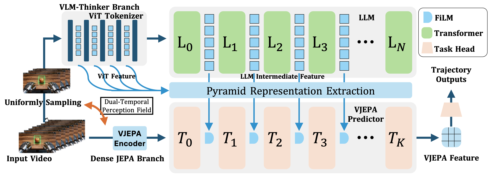

# ThinkJEPA: Empowering Latent World Models with Large Vision-Language Reasoning Model

<p align="center">
  <picture>
    <source media="(prefers-color-scheme: dark)" srcset="logo/logo-dark.png">
    
  </picture>
</p>

<p align="center"><strong>Official implementation of ThinkJEPA.</strong></p>

<p align="center">
  Haichao Zhang<sup>1</sup>, Yijiang Li<sup>2</sup>, Shwai He<sup>3</sup>, Tushar Nagarajan<sup>4</sup>, Mingfei Chen<sup>5</sup>,<br>
  Jianglin Lu<sup>1</sup>, Ang Li<sup>3</sup>, and Yun Fu<sup>1</sup>
</p>

<p align="center">
  <sup>1</sup> Northeastern University
  &nbsp;&nbsp;
  <sup>2</sup> University of California San Diego
  &nbsp;&nbsp;
  <sup>3</sup> University of Maryland
  &nbsp;&nbsp;
  <sup>4</sup> The University of Texas at Austin
  &nbsp;&nbsp;
  <sup>5</sup> University of Washington
</p>

<p align="center">
  For questions about this public release, or if you encounter any issues reproducing the released setup, please contact Haichao Zhang:
  <a href="mailto:zhang.haich@northeastern.edu">zhang.haich@northeastern.edu</a>
</p>

<p align="center">
  <a href="https://arxiv.org/abs/2603.22281"><strong>Paper</strong></a> |
  <a href="https://github.com/Hai-chao-Zhang/ThinkJEPA"><strong>GitHub</strong></a> |
  <a href="https://huggingface.co/datasets/haichaozhang/cache/tree/iso"><strong>Released Preprocessed Cache</strong></a> |
  <a href="#citation"><strong>Citation</strong></a> |
  <a href="#license"><strong>License</strong></a>
</p>

ThinkJEPA is a dual-path embodied prediction framework in which a vision-language model acts as a cortex-like reasoner for high-level semantics and long-horizon intent, while a JEPA branch acts as a cerebellum-like controller for low-level dynamics, physical consistency, and rapid local correction. This repository is the public ThinkJEPA release for reproducing the released training and evaluation setup on EgoDex-style data and cache inputs.

<p align="center">
  <picture>
    <source media="(prefers-color-scheme: dark)" srcset="logo/thinkjepa-dark.png">
    
  </picture>
</p>

## Overview

- The VLM-thinker branch provides high-level reasoning guidance from Qwen3-VL-Thinking features.
- The dense JEPA branch models video dynamics and supplies low-level embodied features for prediction.
- The released training path predicts future trajectory outputs from JEPA features conditioned by pyramid guidance from the VLM branch.
- This public snapshot is intentionally minimal: it includes the core train/eval code, preprocessing scripts, retained EgoDex helpers, and a bundled `vjepa2/` dependency subtree required by the released path.

## Repository Layout

```text
thinkjepa/
├── cache_train/
│   ├── thinker_train.py
│   ├── thinker_predictor.py
│   ├── models.py
│   ├── rebuild_causal_cache.py
│   ├── build_video_cache_splits.py
│   ├── build_portable_hdf5_bundle.py
│   ├── validate_causal_cache.py
│   └── validate_release_bundle.py
├── egodex/
├── scripts/train.sh
├── vjepa2/
├── requirements-public.txt
├── requirements-extraction.txt
├── LICENSE
└── NOTICE
```

## Environment Setup

### Train / Eval Environment

For training and evaluation, we recommend a V-JEPA2-aligned environment.
On this machine, the known working training environment was a conda env similar to `vjepa` with:

- Python `3.11.15`
- `torch==2.10.0+cu128`
- `torchvision==0.25.0+cu128`
- `torchaudio==2.10.0+cu128`
- `decord==0.6.0`
- `numpy==2.3.5`
- `h5py==3.16.0`
- `opencv-python==4.13.0.92`
- `pillow==12.0.0`
- `pyyaml==6.0.3`
- `timm==1.0.25`
- `einops==0.8.2`

Example setup:

```bash
conda create -n thinkjepa-train python=3.11 -y
conda activate thinkjepa-train

# Install a PyTorch stack that matches your CUDA runtime and wheel index.
# The local working environment used CUDA 12.8 wheels.
pip install torch==2.10.0+cu128 torchvision==0.25.0+cu128 torchaudio==2.10.0+cu128 \
  --index-url https://download.pytorch.org/whl/cu128

pip install -r requirements-public.txt
```

The release already bundles the `vjepa2/` source subtree used by the documented ThinkJEPA path. By default, the wrapper scripts point `VJEPA2_ROOT` to `./vjepa2`.

The upstream V-JEPA2 project contains a broader research stack, including tools such as `tensorboard` and `wandb`. Those extras are not required by the released ThinkJEPA train/eval path.

### Qwen3-VL Extraction Environment

If you want to run cache extraction yourself, use a dedicated Qwen3-VL environment instead of reusing the lean train/eval env. On this machine, the known working extraction environment was a conda env similar to `qwen3vl` with:

- Python `3.10.19`
- `torch==2.10.0`
- `torchvision==0.25.0`
- `torchaudio==2.10.0+cu128`
- `torchcodec==0.10.0+cu128`
- `transformers==5.2.0`
- `qwen-vl-utils==0.0.14`
- `huggingface-hub==1.4.1`
- `decord==0.6.0`
- `numpy==2.2.6`
- `h5py==3.16.0`
- `pillow==12.1.1`
- `matplotlib==3.10.8`
- `pyyaml==6.0.3`
- `accelerate==1.12.0`
- `sentencepiece==0.2.1`
- `safetensors==0.7.0`

Example setup:

```bash
conda create -n qwen3vl python=3.10 -y
conda activate qwen3vl

# Install a PyTorch + torchcodec stack that matches your CUDA runtime and wheel index.
# The local working extraction environment used CUDA 12.8 wheels.
pip install torch==2.10.0 torchvision==0.25.0 torchaudio==2.10.0 \
  --index-url https://download.pytorch.org/whl/cu128
pip install torchcodec==0.10.0+cu128 \
  --index-url https://download.pytorch.org/whl/cu128

pip install -r requirements-extraction.txt
```

The causal cache reconstruction script decodes raw MP4 files with `decord`.
If you only plan to reproduce training/evaluation from the released Hugging Face cache, you can skip this extraction environment entirely.

## Data And Cache Preparation

### Use The Prepared Cache

Resolve the Hugging Face `iso` branch to an immutable dataset commit and
materialize exactly that revision into an empty local directory:

The dataset is gated. Accept its access conditions in the Hugging Face web UI,
then authenticate on the training machine before downloading:

```bash
hf auth login
```

```bash
export BUNDLE=/path/on/shared/storage/thinkjepa_iso
export HF_HOME=/path/on/shared/storage/huggingface

export ISO_REVISION="$(python - <<'PY'
from huggingface_hub import HfApi

print(HfApi().dataset_info("haichaozhang/cache", revision="iso").sha)
PY
)"

python - <<'PY'
import os
from huggingface_hub import snapshot_download

snapshot_download(
    repo_id="haichaozhang/cache",
    repo_type="dataset",
    revision=os.environ["ISO_REVISION"],
    local_dir=os.environ["BUNDLE"],
    allow_patterns=[
        "cache/**",
        "supervision_hdf5/**",
        "manifests/portable_v1/**",
        "full_validation.json",
        "VALIDATED_SUCCESS",
    ],
)
PY
```

Validate the materialized bundle before training:

```bash
chmod -R a-w "${BUNDLE}/cache" "${BUNDLE}/supervision_hdf5"

python cache_train/validate_release_bundle.py \
  --bundle-root "${BUNDLE}" \
  --expected-count 2000 \
  --verify-only
```

Do not combine files from different cache revisions. `DATA_DIR` and
`CACHE_DIR` must refer to the separate supervision and feature directories
shown above.

## Training

The training entry point fixes the following method settings:

- 32 observed and 32 future raw frames;
- independent V-JEPA encoder forwards for observed and target clips;
- both cached VLM streams and all cached VLM layers;
- FiLM conditioning in every ThinkJEPA predictor layer;
- causal attention in every predictor layer;
- joint latent and trajectory optimization;
- cached V-JEPA latents, with no online V-JEPA inference.

Batch sizes are per GPU. Training writes `ckpt_latest.pt` for resumption and
`ckpt_best.pt` for the epoch with the lowest validation ADE.

### Smoke test

The smoke test uses the same model and data path as full training, bounded to
two train and two validation batches:

```bash
export BUNDLE=/path/on/shared/storage/thinkjepa_iso
export RUN_ROOT=/path/on/shared/storage/thinkjepa_runs/smoke
export HF_HOME=/path/on/shared/storage/huggingface

DATA_DIR="${BUNDLE}/supervision_hdf5" \
CACHE_DIR="${BUNDLE}/cache" \
TRAIN_MANIFEST="${BUNDLE}/manifests/portable_v1/train_cache.txt" \
VAL_MANIFEST="${BUNDLE}/manifests/portable_v1/test_cache.txt" \
SPLIT_META="${BUNDLE}/manifests/portable_v1/meta.json" \
OUT_DIR="${RUN_ROOT}" \
EPOCHS=1 \
DEBUG=1 \
MAX_TRAIN_BATCHES=2 \
MAX_EVAL_BATCHES=2 \
CHECKPOINT_SELECTION=last \
NO_PRELOAD_CACHE_TO_MEMORY=1 \
bash scripts/train.sh
```

### Single-GPU training

```bash
export BUNDLE=/path/on/shared/storage/thinkjepa_iso
export RUN_ROOT=/path/on/shared/storage/thinkjepa_runs/thinkjepa_1gpu_seed42
export HF_HOME=/path/on/shared/storage/huggingface

DATA_DIR="${BUNDLE}/supervision_hdf5" \
CACHE_DIR="${BUNDLE}/cache" \
TRAIN_MANIFEST="${BUNDLE}/manifests/portable_v1/train_cache.txt" \
VAL_MANIFEST="${BUNDLE}/manifests/portable_v1/test_cache.txt" \
SPLIT_META="${BUNDLE}/manifests/portable_v1/meta.json" \
OUT_DIR="${RUN_ROOT}" \
GPU_LIST=0 \
NPROC_PER_NODE=1 \
TRAIN_BATCH_SIZE=16 \
TEST_BATCH_SIZE=16 \
NUM_WORKERS=4 \
PREFETCH_FACTOR=1 \
EPOCHS=200 \
SEED=42 \
CHECKPOINT_SELECTION=best \
NO_PRELOAD_CACHE_TO_MEMORY=1 \
AUTO_RESUME=1 \
bash scripts/train.sh
```

### Four-GPU training

This configuration uses four GPUs with batch size 16 per GPU, giving an
effective global batch size of 64.

```bash
export BUNDLE=/path/on/shared/storage/thinkjepa_iso
export RUN_ROOT=/path/on/shared/storage/thinkjepa_runs/thinkjepa_4gpu_b16_seed42
export HF_HOME=/path/on/shared/storage/huggingface

# Use the local socket transport for this single-node run. This also avoids
# inheriting an incompatible site-provided OFI NCCL plugin.
unset NCCL_NET_PLUGIN NCCL_NET_OFI_PROVIDER NCCL_PLUGIN_P2P
export NCCL_NET=Socket
export NCCL_IB_DISABLE=1
export NCCL_SOCKET_IFNAME=lo
export GLOO_SOCKET_IFNAME=lo
export NCCL_NVLS_ENABLE=0

DATA_DIR="${BUNDLE}/supervision_hdf5" \
CACHE_DIR="${BUNDLE}/cache" \
TRAIN_MANIFEST="${BUNDLE}/manifests/portable_v1/train_cache.txt" \
VAL_MANIFEST="${BUNDLE}/manifests/portable_v1/test_cache.txt" \
SPLIT_META="${BUNDLE}/manifests/portable_v1/meta.json" \
OUT_DIR="${RUN_ROOT}" \
GPU_LIST=0,1,2,3 \
NPROC_PER_NODE=4 \
TRAIN_BATCH_SIZE=16 \
TEST_BATCH_SIZE=16 \
NUM_WORKERS=4 \
PREFETCH_FACTOR=1 \
EPOCHS=200 \
SEED=42 \
CHECKPOINT_SELECTION=best \
NO_PRELOAD_CACHE_TO_MEMORY=1 \
AUTO_RESUME=1 \
bash scripts/train.sh
```

`CHECKPOINT_SELECTION=best` selects the checkpoint with minimum validation
ADE; its FDE is the FDE from that same ADE-selected epoch. The portable file
named `test_cache.txt` is passed as the validation manifest in the commands
above. Because it participates in model selection, its metrics are validation
results rather than independent held-out test results. Final test reporting
must use a separate group-disjoint test split that was not used for checkpoint
selection. `CHECKPOINT_SELECTION=last` instead keeps the final epoch without
selecting on validation. `validation` remains accepted as an alias for `best`.

## Cache reconstruction

`cache_train/rebuild_causal_cache.py` supplies only observed frames to the VLM
and invokes V-JEPA independently for the observed and target clips. Run its
contract self-test before full extraction:

```bash
python cache_train/rebuild_causal_cache.py \
  --file_dir /path/to/raw/mp4/root \
  --output_dir /path/on/shared/storage/cache_smoke \
  --vjepa_checkpoint /path/to/vjepa2_vitl.pt \
  --self_test
```

For a full rebuild, use an isolated raw root containing exactly the 2000
selected MP4 files expected by the bundle validator:

```bash
export RAW_ROOT=/path/to/selected_2000_raw_videos
export FEATURE_ROOT=/path/on/shared/storage/causal_features
export VJEPA_CHECKPOINT=/path/to/vjepa2_vitl.pt
export HF_HOME=/path/on/shared/storage/huggingface
export QWEN_REVISION="immutable-qwen-commit-sha"

python cache_train/rebuild_causal_cache.py \
  --file_dir "${RAW_ROOT}" \
  --output_dir "${FEATURE_ROOT}" \
  --pretrained Qwen/Qwen3-VL-2B-Thinking \
  --qwen_revision "${QWEN_REVISION}" \
  --vjepa_checkpoint "${VJEPA_CHECKPOINT}" \
  --layers 0 4 8 12 16 20 24 27 \
  --dataset_prompt_mode off \
  --max_new_token_num 16 \
  --qwen_res 256 \
  --save_dtype fp16 \
  --hf_home "${HF_HOME}"
```

After extraction, validate the causal feature set and construct a portable
bundle with separate HDF5 supervision:

```bash
export RAW_ROOT=/path/to/raw/mp4/root
export FEATURE_ROOT=/path/on/shared/storage/causal_features
export HDF5_SOURCE=/path/to/original/egodex_hdf5/root
export SPLIT_STAGE=/path/on/shared/storage/group_split
export BUNDLE=/path/on/shared/storage/thinkjepa_portable
export SOURCE_REPORT=/path/on/shared/storage/source_cache_validation.json

python cache_train/validate_causal_cache.py \
  --raw_dir "${RAW_ROOT}" \
  --cache_dir "${FEATURE_ROOT}" \
  --expected_count 2000 \
  --output_json "${SOURCE_REPORT}"

python cache_train/build_video_cache_splits.py \
  --dataset egodex \
  --data_root "${RAW_ROOT}" \
  --cache_root "${FEATURE_ROOT}" \
  --output_dir "${SPLIT_STAGE}" \
  --subset_size 2000 \
  --train_ratio 0.9 \
  --split_seed 42 \
  --group_by parent

python cache_train/build_portable_hdf5_bundle.py \
  --feature-dir "${FEATURE_ROOT}" \
  --hdf5-source-dir "${HDF5_SOURCE}" \
  --source-split-dir "${SPLIT_STAGE}" \
  --output-dir "${BUNDLE}" \
  --expected-count 2000

mkdir -p "${BUNDLE}/cache"
cp -a --reflink=auto "${FEATURE_ROOT}/." "${BUNDLE}/cache/"
chmod -R a-w "${BUNDLE}/cache" "${BUNDLE}/supervision_hdf5"

python cache_train/validate_release_bundle.py \
  --bundle-root "${BUNDLE}" \
  --source-cache-report "${SOURCE_REPORT}" \
  --expected-count 2000 \
  --write-contract

python cache_train/validate_release_bundle.py \
  --bundle-root "${BUNDLE}" \
  --source-cache-report "${SOURCE_REPORT}" \
  --expected-count 2000 \
  --verify-only
```

## Third-Party Sources

This release retains third-party components that are necessary for the released reproduction path.

- EgoDex-derived helpers under `egodex/` are adapted from Apple's EgoDex project.
  - Source repository: https://github.com/apple/ml-egodex
  - Retained notice files:
    - `egodex/LICENSE.txt`
    - `egodex/ACKNOWLEDGEMENTS.txt`
    - `egodex/utils/LICENSE.txt`
    - `egodex/utils/ACKNOWLEDGEMENTS.txt`
- The bundled `vjepa2/` subtree is derived from the V-JEPA2 repository.
  - Source repository: https://github.com/facebookresearch/vjepa2
  - Retained notice files:
    - `vjepa2/LICENSE`
    - `vjepa2/APACHE-LICENSE`

These third-party notices continue to apply to their respective subtrees and are not replaced by the root ThinkJEPA release license.

## Citation

If you use ThinkJEPA, please cite the paper and link to the original repository:

- Repository: https://github.com/Hai-chao-Zhang/ThinkJEPA

```bibtex
@article{zhang2026thinkjepa,
  title={ThinkJEPA: Empowering Latent World Models with Large Vision-Language Reasoning Model},
  author={Zhang, Haichao and Li, Yijiang and He, Shwai and Nagarajan, Tushar and Chen, Mingfei and Lu, Jianglin and Li, Ang and Fu, Yun},
  journal={arXiv preprint arXiv:2603.22281},
  year={2026}
}
```

See `CITATION.cff` and `CITATION.bib` for machine-readable and BibTeX citation metadata.

## Attribution

If you use, modify, or redistribute ThinkJEPA or derivative code, please:

- retain the `LICENSE` and `NOTICE` files
- retain applicable third-party notices that ship with the repository
- cite the ThinkJEPA paper where citation practices apply
- include a link to the original repository: https://github.com/Hai-chao-Zhang/ThinkJEPA

## License

The root repository is released under the custom `ThinkJEPA Attribution License (BSD-3-Clause-based, custom)`. Redistribution and modification are broadly permitted, provided that required attribution, notice retention, change-marking, and repository-link requirements are followed.

See:

- `LICENSE`
- `NOTICE`
